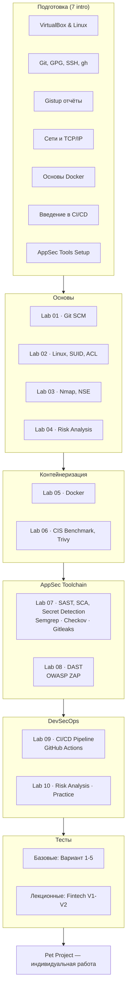

<div align="center">
<a href="https://github.com/geminishkv/course_labs">

</a>
</div>

<div align="center">


</div>

Практический курс по прикладной безопасности приложений: от `Git` до полноценного DevSecOps-конвейера.

**Что изучаем:**

* **Инфраструктура:** `Git`, `CI/CD`, `Docker`, `Docker Compose`, `GitHub Actions`, `YAML`
* **Языки:** `Python`, `Shell` (`Java` и `Go` — в контексте SCA и анализа зависимостей)
* **AppSec инструменты:** `Semgrep`, `Checkov`, `Bandit`, `OWASP Dependency-Check`, `Trivy`, `Docker Bench`, `OWASP ZAP`, `Gitleaks`, `TruffleHog`, `Hadolint`
* **Стандарты:** OWASP Top 10, CIS Docker Benchmark, CVSS, ISO 27005, NIST SP 800-30, PCI DSS, ГОСТ 57580
* **Анализ рисков:** оценка, приоритизация, стратегии снижения рисков ИБ

**Как устроен курс:**

* 7 intro-руководств + 10 лабораторных работ + итоговый pet-project + 7 тестов (5 базовых + 2 лекционных)
* Каждая лабораторная — отдельный репозиторий с исходным кодом и отчётом в формате `gistup`
* Все работы выполняются в ветке `develop` → `pull request` → [approve](https://docs.github.com/en/pull-requests/collaborating-with-pull-requests/proposing-changes-to-your-work-with-pull-requests/requesting-a-pull-request-review) от [geminishkv](https://github.com/geminishkv)
* Прогрессия: `Git` → `Linux` → `Nmap` → `Docker` → `CIS Benchmark` → `SAST/SCA` → `DAST` → `Secret Detection` → `CI/CD` → `Risk Analysis`

**Замечания:**

* Лабораторные обязательны для всех — вне зависимости от уровня подготовки
* Каждая работа разбивается на атомарные коммиты для трекинга изменений
* Отчёт сдаётся индивидуально с защитой: каждая команда — с описанием флагов и выводом из терминала
* В отчётах — вывод из консоли, не скриншоты
* Часть инструментов требует установки дополнительных `open-source` пакетов

### Этапы

1. Выполнить подготовительные инструкции:
    * [Подготовка рабочего окружения](labs/intro/vmbox_tutorial.md) — VirtualBox, установка Linux
    * [Настройка Git, GPG и GitHub CLI](labs/intro/git_setup.md) — git config, SSH, GnuPG, gh
    * [Оформление отчётов Gistup](labs/intro/gistup_guide.md) — формат, структура, правила
    * [Введение в сети и TCP/IP](labs/intro/networking_basics.md) — OSI, порты, DNS, HTTP
    * [Основы Docker](labs/intro/docker_basics.md) — VM vs Container, Dockerfile, Compose
    * [Введение в CI/CD](labs/intro/cicd_basics.md) — GitHub Actions, workflow, секреты
    * [Установка AppSec-инструментов](labs/intro/appsec_tools_setup.md) — Semgrep, Trivy, ZAP, Gitleaks, Checkov
2. Каждый репозиторий должен содержать `.gitignore`, `CODE_OF_CONDUCT`, `CONTRIBUTING`, `LICENSE`, `NOTICE`, `SECURITY`
3. Выполнить лабораторные работы по порядку:

-  [ ] lab01 — [GitSCM — подготовка рабочего окружения](labs/basic/lab01/README.md)
-  [ ] lab02 — [*nix — права доступа, SUID, ACL, процессы](labs/basic/lab02/README.md)
-  [ ] lab03 — [Nmap — сканирование сети, NSE и защита результатов](labs/basic/lab03/README.md)
-  [ ] lab04 — [Анализ и определение мер снижения рисков ИБ](labs/basic/lab04/README.md)
-  [ ] lab05 — [Docker — контейнеризация приложений](labs/basic/lab05/README.md)
-  [ ] lab06 — [Docker CIS Benchmark и Trivy](labs/basic/lab06/README.md)
-  [ ] lab07 — [SAST, SCA и Secret Detection](labs/basic/lab07/README.md)
-  [ ] lab08 — [DAST — OWASP ZAP и ручное тестирование](labs/basic/lab08/README.md)
-  [ ] lab09 — [DevSecOps CI/CD конвейер на GitHub Actions](labs/basic/lab09/README.md)
-  [ ] lab10 — [Оценка анализа рисков ИБ — практика](labs/basic/lab10/README.md)

4. Реализовать итоговую работу:

-  [ ] pet_project — [Индивидуальный проект: полный стек AppSec/DevSecOps](labs/pet_project/README.md)

***

### Карта



***

### Формализованные требования

- Единый стиль кода
- Все функции по работе с деревом должны находиться в пространстве имен
- Оформление `README.md` в соответствии с содержанием проекта
- Оформление `.gitignore` в соответствии с содержанием проекта
- Оформление `.dockerignore` в соответствии с содержанием проекта
- Использовать подходящий тип `LICENSE` для проекта и `NOTICE`
- Создать и использовать скрипты для автоматизации сборки проекта, примеров, тестов, пакетирования
- Обеспечить непрерывный процесс сборки проекта с использованием сервиса `GitHub Actions`
- Написать документацию к проекту с использованием инструмента **doxygen**
- Обеспечить размещение пакета проекта на сервисе `GitHub Release` при успешном слияние ветки `develop`
- Рефакторинг и поддержка лабораторных работ в процессной деятельности
- Все команды выполняться строго из `терминала/ консоли` без использования `WebUI` за исключениям работы с токенами, ключами и специфичными настройками

***

### Tutorial

* Подготовка окружения

```bash
$ python3 -m venv .venv
$ source .venv/bin/activate
$ pip install -r requirements.txt
$ python -m mkdocs serve --livereload
# or
$ mkdocs serve -a 127.0.0.1:8001 # прямое обозначение адреса
```

* Перегенерация Mermaid-диаграмм (при изменении `.mmd` файлов)

```bash
$ cd docs/artifacts/diagrams
$ for f in *.mmd; do
    npx --yes @mermaid-js/mermaid-cli \
      -i "$f" -o "${f%.mmd}.svg" \
      -c mermaid-config.json -b transparent
  done
```

* Очистка локального репозитория

```bash
$ rm -rf __pycache__ scripts/__pycache__
$ rm -rf .venv
$ lsof -i :8000
$ kill <PID>
```

* Release

```bash
$ git tag -a v1.0.0 -m "v1.0.0"
$ git push origin v1.0.0

$ git tag -d v0.1.0                    # удалить локальный тег
$ git push --delete origin v1.2.3   # удалить тот же тег на GitHub
```

***

### Структура

```
├── docs/                              # MkDocs source (обёртки + материалы)
│   ├── index.md                       # Главная (hero + lab cards + tg widget)
│   ├── about.md                       # О проекте
│   ├── privacy.md                     # Политика конфиденциальности
│   ├── Security.md                    # Политика безопасности
│   ├── RELEASE_NOTES.md               # Релизы
│   ├── glossary.md                    # 39 аббревиатур AppSec
│   ├── robots.txt                     # Robots + AI-bot blocking
│   ├── llms.txt                       # Описание для AI-поисковиков
│   ├── turbo-feed.xml                 # Яндекс.Турбо RSS
│   ├── labs/
│   │   ├── intro/                     # 7 docs-обёрток intro
│   │   ├── basic/lab01-10.md          # 10 docs-обёрток лабораторных
│   │   ├── pet_project.md             # Итоговый проект
│   │   └── tests/
│   │       ├── basic/                 # 5 вариантов базовых тестов
│   │       └── lectures/              # 2 варианта теста Fintech
│   ├── materials/
│   │   ├── lectures/fintech_ru.md     # Лекция Fintech по-русски
│   │   ├── examples/                  # 5 кейсов ИБ
│   │   ├── OWASPTOP10/               # 7 OWASP материалов
│   │   ├── cheatsheet/               # 9 шпаргалок
│   │   ├── ports.md                   # Справочник портов
│   │   ├── appsec_tt.md              # 29 классов инструментов
│   │   ├── licenses.md               # 41 лицензия
│   │   ├── APPENDIX.md               # Команды и утилиты
│   │   └── troubleshooting.md        # FAQ (~45 карточек)
│   ├── stylesheets/                   # CSS (tokens, layout, header, sidebar, ...)
│   ├── javascripts/                   # JS (header, typewriter, banners, effects)
│   ├── overrides/                     # main.html (SEO, JSON-LD, Метрика), 404.html
│   └── artifacts/
│       ├── assets/                    # Logo (SVG), favicon (ICO), images
│       └── diagrams/                  # 7 Mermaid SVG + .mmd исходники
├── labs/
│   ├── intro/                         # 7 intro-руководств (исходники)
│   ├── basic/lab01-10/               # 10 лабораторных (код + README + docker-compose)
│   ├── pet_project/                   # Итоговый проект
│   └── tests/
│       ├── basic/                     # 5 базовых тестов (исходники)
│       └── lectures/ru_fintech/       # 2 варианта теста Fintech (исходники)
├── .github/workflows/
│   ├── ci.yml                         # Lint → Audit → Mermaid SVG → Build → Deploy
│   └── release-from-notes.yml
├── hooks.py                           # Sitemap enrichment (priority + changefreq)
├── mkdocs.yml
├── requirements.txt
└── RELEASE_NOTES.md
```
